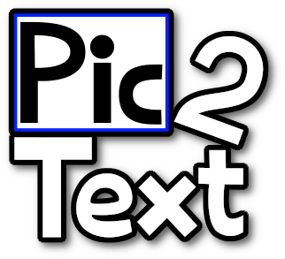
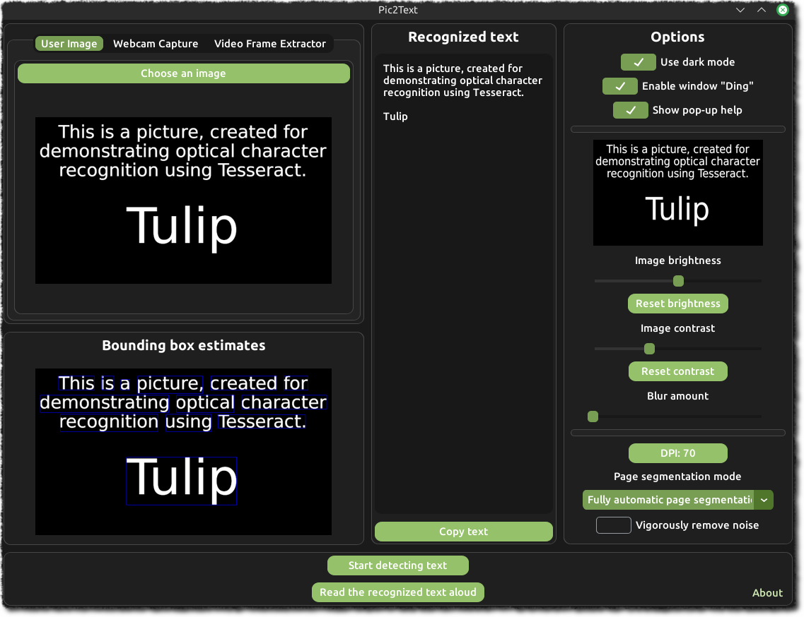

# 



**This is a Python app that reads text from any source, using optical character recognition. It is a convenient tool. You can open a picture, the camera on your laptop, or any video, and read text from that source. You can then copy the recognised text, so you can keep notes, or send it to someone else. You can also read aloud the recognised text, useful for the blind people.**

## App Dependencies

This app uses several libraries, including external programs that the app uses.

This app utilizes:

- CustomTkinter, for the graphical user interface of the app.
    - CTkMessagebox, to display message to the user.
    - CTkToolTip, to display information when the user hovers on a widget.
    - File dialog from the tkinter library.
- Tesseract, via. pytesseract, for optical character recognition.
- pyttsx3, for text to speech.
- ffmpeg, for splitting video files to frames.
- opencv, for webcam capture, image overlay, and miscellaneous uses.
- pyperclip, for copying the text to the user's clipboard
- Pillow, for miscellaneous uses.
- numpy, for miscellaneous uses.

## Setup ( For Windows )

First, install Python. https://www.python.org/downloads In the installer, choose "Install Now".

Next, install Tesseract. https://github.com/UB-Mannheim/tesseract/wiki#tesseract-installer-for-windows

In the installer, make sure to set the destination folder to `C:\Program Files\Tesseract-OCR`


Then, download ffmpeg. https://www.gyan.dev/ffmpeg/builds/#git-master-builds

Find `ffmpeg-git-full.7z`, then download that file. Make sure to install 7-Zip to open the file.

Once you have opened the file in 7-Zip, extract the folder to `C:\`, and rename the folder to `FFmpeg`.


Now, you should add ffmpeg to your PATH. Open Search <kbd>Win</kbd> + <kbd>S</kbd>, and type "Edit the system environment variables". You should see this.


Once you've opened the program, click "Environment Variables...", then select the "Path" variable.


Click "Edit...", then "Browse...". Go to `This PC > Local Disk (C:) > FFmpeg > bin`, then click "OK".


Then install Git for Windows. Download the latest version. https://git-scm.com/download/win

Next, after Git is installed, open Command Prompt (cmd.exe) and run the following commands.

```
git clone --recursive https://github.com/LoKiToon/Pic2Text
cd Pic2Text
install-dep-win.bat
```

Now you can start the app.

`python Pic2Text.py`

## Setup ( For Linux )

Make sure you have Git installed. ( If it's not already installed. )

`sudo apt install git`

Open a terminal and type the following commands.

```
git clone --recursive https://github.com/LoKiToon/Pic2Text
cd Pic2Text
chmod 755 install-dep-linux.sh
./install-dep-linux.sh
```

After the installation is done, you can start the app.

`python3 Pic2Text.py`

## How To Use This App

### Choose The Image Source


1. User Image - Choose an image from the file picker.
2. Webcam Capture - Take a picture from your webcam.
3. Video Frame Extractor - Choose a specific frame from any supported video file.

Note: Make sure the picture shows text clearly, without the background getting in the way.

### Start Detecting Text

Now that you have chosen your image source, you can now start detecting text by clicking the “Start detecting text” button.

After waiting a bit, the text should be recognized, and the app will show you where the text was detected.

Now, you can either copy the recognized text to your clipboard, or have the computer read the text out loud to you.

### The Options

- App Options

  - Use dark mode - Changes the current appearance of the app. On: Light mode, Off: Dark mode.
  - Enable window "Ding" - If this option is on, make a sound when a message is shown or when a task is complete.
  - Show pop-up help - If this option is on, show pop-up help when hovering your pointer on a widget.

- Optical Character Recognition Options

  - DPI - Optional. Changes the DPI of the recognised image. You may enter a number between 70 to 2400.
  - Page segmentation mode - Changes the current method of reading text.
  - Vigorously remove noise - If this option is on, reduce the noise of the image intensely. 

- Image Adjustment Options

  - Image Preview - A preview of the image, with the applied brightness and contrast controls
  - Image Brightness Slider - Drag the slider to change the brightness of the image. Click the button below the slider to reset its value.
  - Image Contrast Slider - Drag the slider to change the contrast of the image. Click the button below the slider to reset its value.
  - Blur Amount Slider - Drag the slider to change the softness of the image. Use it when the image has noise, and it interferes with the optical character recognition.

## [User Manual](Pic2Text_User_Manual.pdf)

## [Link to App Development Toolkit Workbook](https://docs.google.com/spreadsheets/d/1huna7g1E7eWEHNenM4X6gNFcnYXJcmq-/edit?usp=sharing&ouid=104577051238204190186&rtpof=true&sd=true)